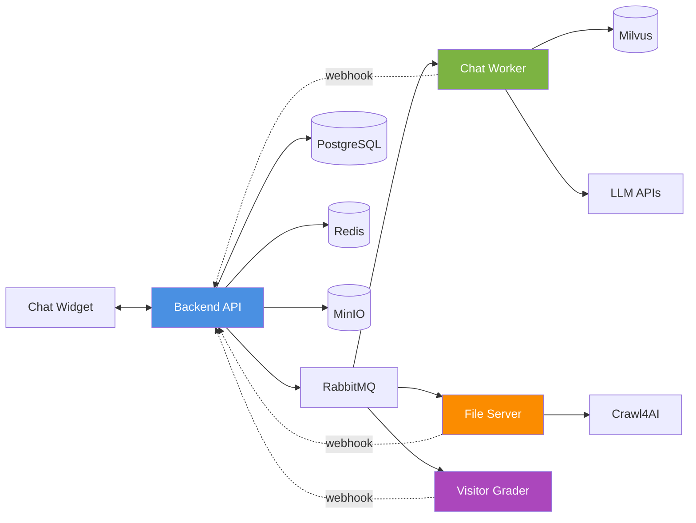

# Chatbot Embed Platform

Single organization chatbot platform with widget embedding, provider/model catalog management, visitor lead scoring, and invite-based user management.

## Tech Stack

- **Backend**: FastAPI (async)
- **Database**: PostgreSQL 15+ (SQLAlchemy ORM)
- **Vector DB**: Milvus 2.6
- **Object Storage**: MinIO
- **Cache**: Redis
- **Queue**: RabbitMQ
- **Embedding**: intfloat/multilingual-e5-base
- **Web Crawler**: Crawl4AI

---

## Quick Start

### 1. Clone & Setup Environment

```bash
# Clone repository
git clone <repository>
cd embed_chatbot

# Copy environment template
cp .env.example .env

# Edit .env with your configurations
nano .env
```

**Important**: Edit `.env` file and change at minimum these values:

```bash
# Security (REQUIRED for production!)
JWT_SECRET_KEY=your-super-secret-jwt-key-minimum-32-characters
ENCRYPTION_KEY=your-encryption-key-32-characters-long!!

# Database
POSTGRES_PASSWORD=your_secure_postgres_password

# MinIO
MINIO_ROOT_PASSWORD=your_secure_minio_password
MINIO_PUBLIC_URL=https://your-domain.com  # Or http://localhost:9000 for local

# Root User (Initial Login)
ROOT_EMAIL=admin@example.com
ROOT_PASSWORD=your_secure_root_password

# API Docs Protection (stg/prod)
DOCS_USERNAME=admin
DOCS_PASSWORD=your_secure_docs_password

# Email (Optional but recommended)
SMTP_HOST=smtp.gmail.com
SMTP_PORT=587
SMTP_USER=your-email@gmail.com
SMTP_PASS=your-app-password
EMAIL_FROM=noreply@yourcompany.com
EMAIL_FROM_NAME=Your Company Name
```

### 2. Start Services

```bash
# Development mode (auto-reload, debug logs)
ENV=dev docker-compose up -d

# Staging mode (Gunicorn, protected docs)
ENV=stg docker-compose up -d

# Production mode (optimized, no reload)
ENV=prod docker-compose up -d
```

Wait for all services to be healthy (~30-60 seconds):

```bash
docker-compose ps
```

### 3. Initial Configuration (First Time Only)

After starting containers, run these one-time setup steps:

#### Upload Email Logo

**From Host Machine:**

```bash
# Upload email branding image to MinIO
python backend/scripts/upload_email_image.py
```

**From Docker Container:**

```bash
docker exec embed_chatbot_backend python scripts/upload_email_image.py
```

This uploads `backend/app/static/img/email.jpg` to MinIO for email templates.

#### Upload Chat Widget

**From Host Machine:**

```bash
# Local development
python backend/scripts/upload_widget.py --url http://localhost:18000

# Production (use your actual backend URL)
python backend/scripts/upload_widget.py --url https://your-backend.com
```


This makes the chat widget available at `https://your-domain/widget/latest/standalone-widget.js`.

> **Note**: These scripts read credentials from environment variables (`ROOT_EMAIL`, `ROOT_PASSWORD`) set in your `.env` file.

### 4. Access Services

---

## Environment Modes

| Mode | Workers | Reload | Docs Access | Logs | Use Case |
|------|---------|--------|-------------|------|----------|
| **dev** | 1 (Uvicorn) | ✅ Yes | 🔓 Open | Debug, Colored | Local development |
| **stg** | 2 (Gunicorn) | ✅ Yes | 🔒 Basic Auth | Debug | Staging/Testing |
| **prod** | 4 (Gunicorn) | ❌ No | 🔒 Basic Auth | Info | Production |

---

---

## Services Overview

The platform consists of multiple microservices working together. See [docs/](./docs/) for detailed documentation.

### Core Services

| Service | Port | Description | Documentation |
|---------|------|-------------|---------------|
| **Backend API** | 18000 | FastAPI application handling API requests, authentication, bot management | [Architecture](./docs/architecture.md) |
| **Chat Worker** | 8001 | Processes chat messages using RAG pipeline with LangGraph | [Chat Flow](./docs/chat_conversation_flow.md) |
| **File Server** | 8002 | Handles document upload, processing, and web crawling | [Bot Creation](./docs/bot_creation_flow.md) |
| **Visitor Grader** | 8003 | AI-powered lead scoring and visitor assessment | [Assessment Flow](./docs/visitor_assessment_flow.md) |

### Infrastructure Services

| Service | Port | Description |
|---------|------|-------------|
| **PostgreSQL** | 15432 | Primary database for all application data |
| **Redis** | 16379 | Cache, pub/sub for real-time features, session storage |
| **RabbitMQ** | 5672 (AMQP)<br/>15672 (Management) | Message queue for inter-service communication |
| **MinIO** | 9000 (API)<br/>9001 (Console) | S3-compatible object storage for documents and media |

### AI Services

| Service | Port | Description |
|---------|------|-------------|
| **Milvus** | 19532 (API)<br/>19091 (Metrics) | Vector database for semantic search (BGE-M3 embeddings) |
| **Etcd** | 2379 | Milvus metadata storage |
| **Crawl4AI** | 11235 | Intelligent web crawler with JavaScript support |

### Service Communication



📚 **Detailed Architecture**: See [docs/architecture.md](./docs/architecture.md) for complete system architecture diagrams and data flow.

---

## API Documentation

### Development (ENV=dev)
- Swagger UI: http://localhost:18000/docs
- ReDoc: http://localhost:18000/redoc
- **No authentication required**

### Staging/Production (ENV=stg/prod)
- Swagger UI: http://localhost:18000/docs
- ReDoc: http://localhost:18000/redoc
- **Requires Basic Auth** (use DOCS_USERNAME & DOCS_PASSWORD from .env)

---

## Common Commands

### View Logs
```bash
# All services
docker-compose logs -f

# Specific service
docker-compose logs -f backend
docker-compose logs -f postgres
```

### Stop Services
```bash
docker-compose down
```

### Stop & Remove Volumes (⚠️ Deletes all data)
```bash
docker-compose down -v
```

### Rebuild Backend
```bash
docker-compose up -d --build backend
```

### Database Migrations
```bash
# Enter backend container
docker exec -it embed_chatbot_backend bash

# Run migrations
alembic upgrade head

# Create new migration
alembic revision --autogenerate -m "description"
```

### Access Database
```bash
docker exec -it embed_chatbot_database psql -U postgres -d chatbot_db
```

### Access Redis
```bash
docker exec -it embed_chatbot_redis redis-cli
```

---

## Project Structure

```
embed_chatbot/
├── .env                    # Environment variables (copy from .env.example)
├── .env.example            # Environment template
├── docker-compose.yml      # Docker services
│
└── backend/
    ├── Dockerfile
    ├── start.sh           # Environment-based startup script
    ├── main.py            # FastAPI entry point
    ├── requirements.txt
    │
    └── app/
        ├── api/v1/        # API endpoints
        ├── models/        # SQLAlchemy models
        ├── schemas/       # Pydantic schemas
        ├── services/      # Business logic
        ├── core/          # Core configs
        ├── common/        # Shared code (enums, constants, types)
        ├── cache/         # Redis cache service
        └── utils/         # Utilities
```

---

## Security Notes

1. **Change default passwords** in `.env`
2. **Use strong JWT secret** (minimum 32 characters)
3. **Set DOCS_USERNAME/PASSWORD** for staging/production
4. **Never commit `.env`** file (already in .gitignore)
5. **Use HTTPS** in production
6. **Restrict CORS_ORIGINS** in production (don't use `*`)

---

## Troubleshooting

### Backend won't start
```bash
# Check logs
docker-compose logs backend

# Check if dependencies are healthy
docker-compose ps

# Rebuild
docker-compose up -d --build backend
```

### Database connection error
```bash
# Check Postgres is running
docker-compose ps postgres

# Check connection
docker exec embed_chatbot_backend curl postgres:5432
```

### Redis connection error
```bash
# Test Redis
docker exec -it embed_chatbot_redis redis-cli ping
```

### Milvus connection error
```bash
# Check Milvus health
curl http://localhost:19091/healthz

# Check dependencies (etcd, minio)
docker-compose ps etcd minio
```

### RabbitMQ Connection Issues

If you're seeing "Stream connection lost: Connection reset by peer" errors, use the diagnostic tools:

**Backend RabbitMQ Health Check:**
```bash
# Run from backend container
docker exec -it embed_chatbot_backend python /app/scripts/rabbitmq_health_check.py
```

**File-Server RabbitMQ Diagnostics:**
```bash
# Run from file-server container
docker exec -it embed_chatbot_file_server python /app/scripts/rabbitmq_diagnostics.py
```

**Check if file-server is healthy:**
```bash
# The file-server healthcheck includes RabbitMQ status
docker-compose ps file-server
```

**Common fixes for RabbitMQ connection issues:**
1. Restart the file-server service: `docker-compose restart file-server`
2. Check network connectivity between services: `docker network inspect embed_chatbot_chatbot_network`
3. Ensure the file-server container is running RabbitMQ: `docker exec embed_chatbot_file_server rabbitmqctl status`

---

## Additional Resources

- [FastAPI Documentation](https://fastapi.tiangolo.com/)
- [Milvus Documentation](https://milvus.io/docs)
- [MinIO Documentation](https://min.io/docs/)
- [Multilingual E5 Model](https://huggingface.co/intfloat/multilingual-e5-base)

---

## License

MIT License