# Chatbot Embed Platform - Architecture

Kiến trúc tổng quan của hệ thống Chatbot Embed Platform với microservices, RAG pipeline, và visitor lead scoring.

---

## 🏗️ Tổng quan kiến trúc

### System Architecture Diagram

### High-Level Overview

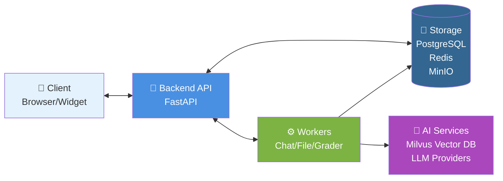

### Detailed Architecture

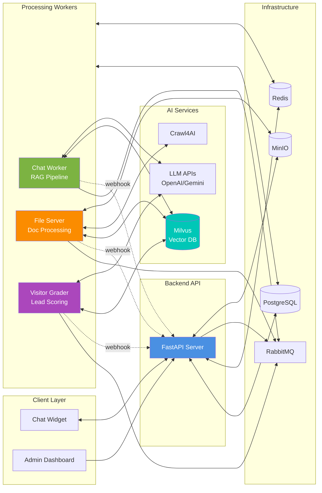

---

## 🔧 Core Components

### 1. Backend API (FastAPI)

**Chức năng chính:**
- RESTful API endpoints
- Authentication & authorization (JWT)
- Bot configuration management
- User & organization management
- Widget token generation
- Webhook handling
- Real-time streaming via SSE

**Tech Stack:**
- FastAPI (async)
- SQLAlchemy ORM
- Pydantic validation
- Alembic migrations

**Endpoints:**
- `/api/v1/auth` - Authentication
- `/api/v1/bots` - Bot management
- `/api/v1/documents` - Document upload
- `/api/v1/chat` - Chat gateway
- `/api/v1/widget` - Widget API
- `/api/v1/admin` - Admin operations
- `/api/v1/webhooks` - Service webhooks

---

### 2. Chat Worker (RAG Pipeline)

**Chức năng chính:**
- Process chat messages via RabbitMQ
- LangGraph-based conversational AI
- RAG (Retrieval Augmented Generation)
- Two-stage adaptive retrieval
- Long-term memory management
- Token streaming via Redis Pub/Sub

**Architecture:**

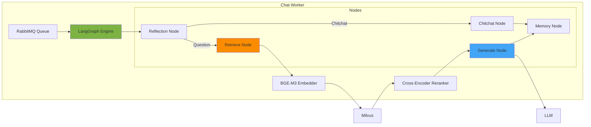

---

### 3. File Server (Document Processing)

**Chức năng chính:**
- Document chunking & embedding
- Web crawling với Crawl4AI
- Upload to MinIO
- Vector storage in Milvus
- Progress tracking via Redis
- Webhook notifications

**Processing Pipeline:**

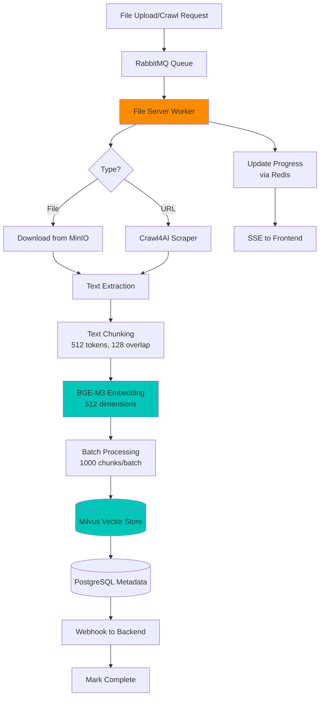

---

### 4. Visitor Grader (Lead Scoring)

**Chức năng chính:**
- Analyze visitor chat history
- RAG-based lead qualification
- Score: Hot (70+), Warm (40-69), Cold (0-39)
- Email notifications to sales team
- Async processing via RabbitMQ

**Scoring Flow:**

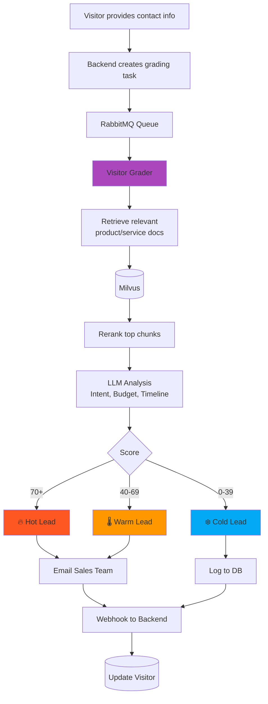

---

## 💾 Data Layer

### Database Schema

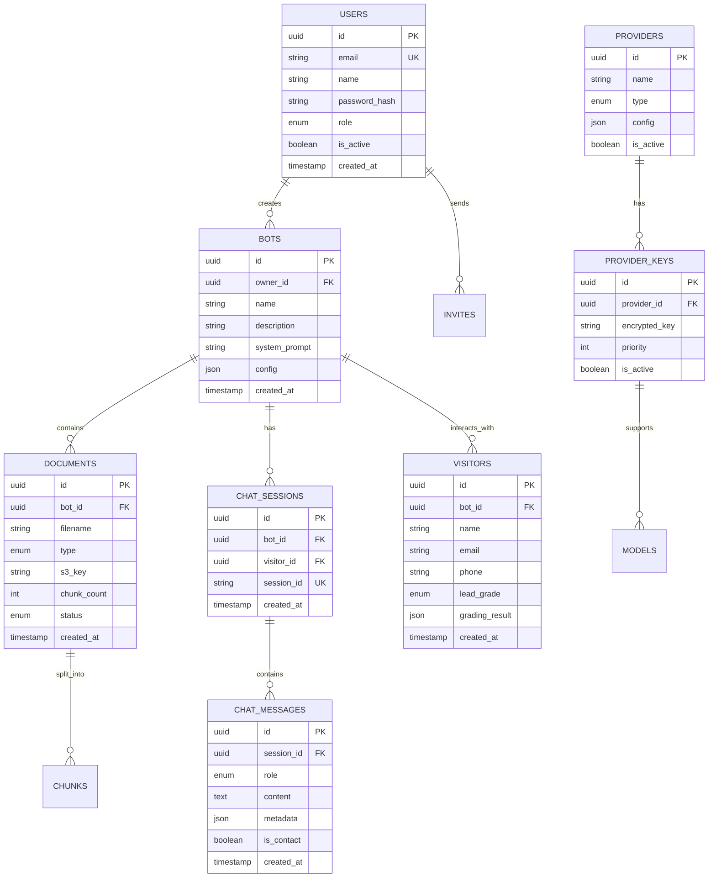

### Milvus Collections

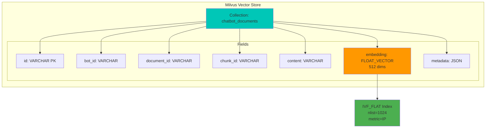

---

## 🔄 Key Workflows

### Chat Conversation Flow

Xem chi tiết: [chat_conversation_flow.md](../backend/docs/chat_conversation_flow.md)

**Tóm tắt:**
1. Widget gửi message → Backend API
2. Backend tạo task → RabbitMQ queue
3. Chat Worker xử lý qua LangGraph:
   - **Reflection**: Phân tích intent, ngôn ngữ
   - **Retrieve**: 2-stage adaptive retrieval + reranking
   - **Generate**: LLM với context từ RAG
   - **Memory**: Update long-term memory
4. Stream tokens qua Redis Pub/Sub → Widget via SSE
5. Save to PostgreSQL
6. Nếu có contact info → trigger Visitor Grader

---

### Document Processing Flow

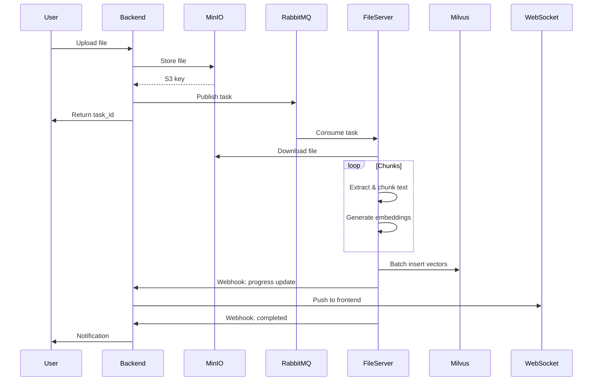

---

### Lead Scoring Flow

Xem chi tiết: [visitor_assessment_flow.md](../backend/docs/visitor_assessment_flow.md)

**Trigger:**
- User provides contact info trong chat
- Backend tạo visitor record
- Enqueue grading task to RabbitMQ

**Process:**
1. Visitor Grader retrieves chat history
2. RAG retrieval từ bot's documents
3. LLM analyzes:
   - Purchase intent
   - Budget signals
   - Timeline urgency
   - Fit score
4. Calculate final score → assign grade
5. Email sales team với insights
6. Webhook update to Backend

---

## 🔐 Security Architecture

### Authentication Flow

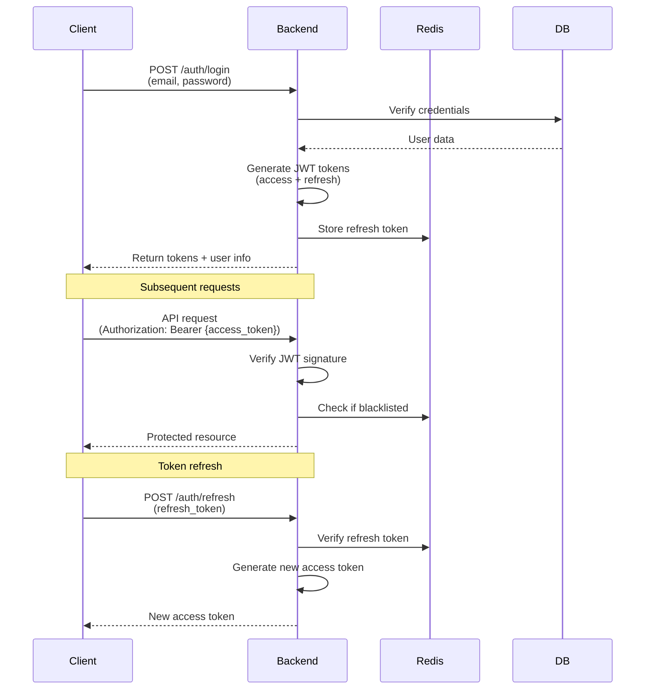

### Widget Token Flow

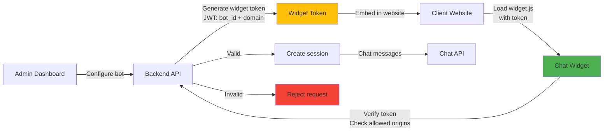

---

## 📊 Scalability & Performance

### Caching Strategy

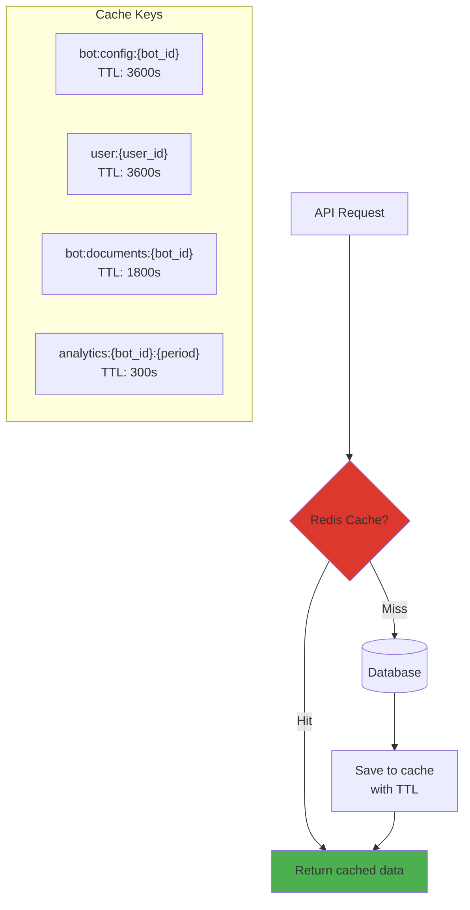

### Rate Limiting

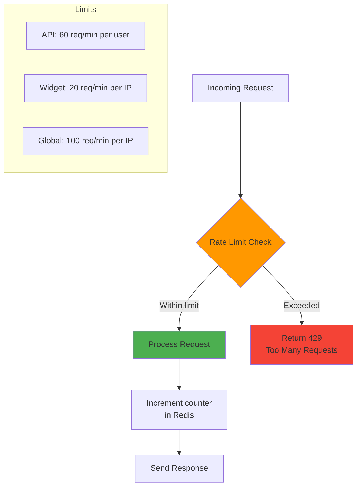

---

## 🚀 Deployment Architecture

### Docker Compose Services

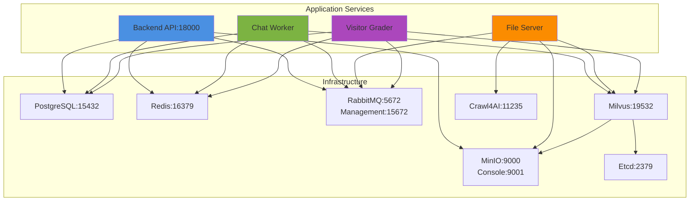

### Environment Modes

| Mode | Workers | Reload | Docs | Logs | Use Case |
|------|---------|--------|------|------|----------|
| **dev** | 1 (Uvicorn) | ✅ | 🔓 Open | Debug | Local development |
| **stg** | 2 (Gunicorn) | ✅ | 🔒 Auth | Debug | Staging/Testing |
| **prod** | 4 (Gunicorn) | ❌ | 🔒 Auth | Info | Production |

---

## 🔍 Monitoring & Observability

### Key Metrics

**Performance:**
- API response time (p50, p95, p99)
- Chat latency breakdown (reflection, retrieval, generation)
- Document processing throughput
- Vector search latency

**Business:**
- Active bots count
- Messages per day/bot
- Document chunks indexed
- Visitor grading completion rate
- Hot/Warm/Cold lead distribution

**System:**
- CPU & memory usage
- Database connections
- Redis cache hit rate
- RabbitMQ queue depth
- Milvus vector count

### Health Checks

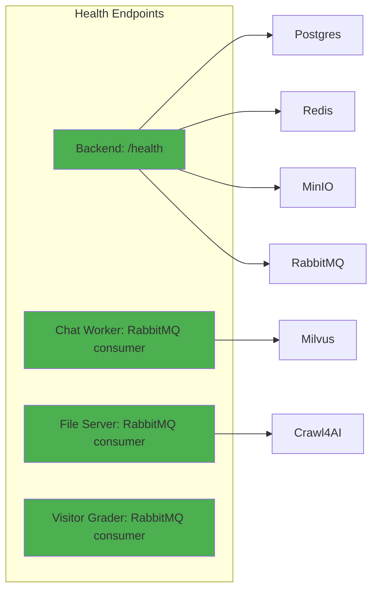

---

## 📁 Directory Structure

```
embed_chatbot/
├── backend/                    # FastAPI backend
│   ├── app/
│   │   ├── api/v1/            # API endpoints
│   │   ├── models/            # SQLAlchemy models
│   │   ├── schemas/           # Pydantic schemas
│   │   ├── services/          # Business logic
│   │   ├── core/              # Config & settings
│   │   ├── cache/             # Redis cache
│   │   └── utils/             # Helpers
│   ├── alembic/               # DB migrations
│   └── docs/                  # Documentation
│
├── chat-worker/               # RAG pipeline
│   ├── app/
│   │   ├── graph/             # LangGraph nodes
│   │   ├── services/          # Retrieval, LLM
│   │   └── models/            # Data models
│
├── file-server/               # Document processor
│   ├── app/
│   │   ├── services/          # Chunking, embedding
│   │   └── workers/           # RabbitMQ workers
│
├── visitor-grader/            # Lead scorer
│   ├── app/
│   │   ├── services/          # Grading logic
│   │   └── workers/           # RabbitMQ workers
│
├── frontend/                  # Admin dashboard (Next.js)
│   └── src/
│       ├── components/
│       ├── pages/
│       └── services/
│
└── docker-compose.yml         # Service orchestration
```

---

## 🔗 Related Documentation

- [Chat Conversation Flow](../backend/docs/chat_conversation_flow.md) - RAG pipeline chi tiết
- [Bot Creation Flow](../backend/docs/bot_creation_flow.md) - Quy trình tạo bot
- [Visitor Assessment Flow](../backend/docs/visitor_assessment_flow.md) - Lead scoring
- [README.md](../README.md) - Quick start guide

---

## 🛠️ Technology Stack Summary

| Layer | Technologies |
|-------|-------------|
| **Backend** | FastAPI, SQLAlchemy, Pydantic, Alembic |
| **AI/ML** | LangGraph, BGE-M3, Cross-Encoder Reranker |
| **Database** | PostgreSQL, Milvus (vector DB) |
| **Cache** | Redis (cache + pub/sub) |
| **Queue** | RabbitMQ |
| **Storage** | MinIO (S3-compatible) |
| **Crawler** | Crawl4AI |
| **Frontend** | Next.js, React, TailwindCSS |
| **Deployment** | Docker, Docker Compose |
| **LLM Providers** | OpenAI, Google Gemini, Anthropic Claude |

---

**Last Updated:** 2025-12-23
