# Bot Creation Workflow

Workflow đơn giản: Tạo bot → RabbitMQ → Crawl (File Server) → Progress Tracking (Redis)

```mermaid
flowchart TD
    Start([Admin tạo bot]) --> CreateBot[POST /api/v1/bots]
    
    CreateBot --> GenID[Generate bot_key & bucket_name]
    GenID --> SaveDB[(Lưu Bot vào PostgreSQL<br/>status=DRAFT)]
    SaveDB --> CreateBucket[Tạo MinIO bucket]
    CreateBucket --> SaveOrigin[(Lưu AllowedOrigin<br/>origin + sitemap_urls)]
    
    SaveOrigin --> EnqueueTask{Enqueue crawl task}
    
    EnqueueTask --> CheckLock[Redis: Check crawl lock]
    CheckLock --> SetLock[Redis: Set crawl lock<br/>TTL=2h]
    SetLock --> InitState[Redis: Init task state<br/>status=PENDING]
    
    InitState --> PublishMQ[RabbitMQ: Publish task<br/>task_id, bot_id, origin,<br/>sitemap_urls]
    
    PublishMQ --> ReturnAPI[Return: bot, task_id,<br/>sse_endpoint]
    
    ReturnAPI -.-> FileServer[File Server nhận task]
    
    FileServer --> CrawlMode{Có sitemap_urls?}
    
    CrawlMode -->|Yes| CrawlSitemap[Crawl specific URLs<br/>từ sitemap]
    CrawlMode -->|No| CrawlBFS[BFS crawl<br/>toàn bộ domain]
    
    CrawlSitemap --> ProcessPage[Process mỗi page]
    CrawlBFS --> ProcessPage
    
    ProcessPage --> Extract[Extract content]
    Extract --> Chunk[Chunk text]
    Chunk --> Embed[Generate embeddings]
    Embed --> StoreMilvus[(Store vectors<br/>vào Milvus)]
    StoreMilvus --> SaveDoc[(Lưu Document<br/>vào PostgreSQL)]
    SaveDoc --> UpdateRedis[Redis: Update progress<br/>task_state:task_id]
    
    UpdateRedis --> MorePages{Còn pages?}
    MorePages -->|Yes| ProcessPage
    MorePages -->|No| Complete[Redis: Set COMPLETED]
    
    Complete --> ReleaseLock[Redis: Release crawl lock]
    ReleaseLock --> End([Crawl hoàn tất])
    
    style Start fill:#e1f5ff
    style CreateBot fill:#fff4e1
    style PublishMQ fill:#ffe1e1
    style FileServer fill:#e1ffe1
    style UpdateRedis fill:#ffe1f5
    style Complete fill:#d4edda
    style End fill:#e1f5ff
```



## Giải thích Flow

### 1. Tạo Bot
- Admin gọi `POST /api/v1/bots` với: `{name, origin, sitemap_urls, language}`
- Hệ thống generate: 
  - `bot_key`: `bot_{uuid}`
  - `bucket_name`: `bucket-{uuid}`
- Lưu Bot vào DB (status=DRAFT)
- Tạo MinIO bucket để lưu documents
- Lưu `AllowedOrigin` (origin + sitemap_urls)

### 2. RabbitMQ Task Queue
- Check crawl lock trong Redis (tránh duplicate)
- Set crawl lock (TTL 2h)
- Init task state: `PENDING`
- **Publish task vào RabbitMQ** với data:
  ```json
  {
    "task_id": "uuid",
    "bot_id": "bot_uuid",
    "origin": "https://example.com",
    "sitemap_urls": ["url1", "url2"],
    "collection_name": "collection_uuid"
  }
  ```

### 3. File Server Crawl
- File Server nhận task từ RabbitMQ
- **Crawl logic:**
  - Có `sitemap_urls` → Crawl specific URLs
  - Không có → BFS crawl toàn bộ domain
- Mỗi page:
  1. Extract content
  2. Chunk text thành segments
  3. Generate embeddings
  4. Store vectors vào Milvus
  5. Lưu Document vào PostgreSQL
  6. **Update progress vào Redis**

### 4. Progress Tracking (Redis)
- Frontend lắng nghe SSE: `/tasks/{task_id}/progress`
- Redis key: `task_state:{task_id}`
- Update real-time:
  - `progress`: 0-100%
  - `status`: PENDING → PROCESSING → COMPLETED
  - `message`: "Crawling page X/Y"
- Khi done:
  - Set status = COMPLETED
  - Release crawl lock

## Redis Keys

| Key | Purpose | TTL |
|-----|---------|-----|
| `crawl_lock:{bot_id}` | Prevent duplicate crawls | 2h |
| `task_state:{task_id}` | Crawl progress tracking | 24h |
| `allowed_origins:{bot_key}` | CORS validation cache | Config |

## RabbitMQ Queues

- **`crawl_tasks`**: Website crawling jobs
- **`recrawl_tasks`**: Re-crawl với vector deletion
