# Chat Conversation Flow

Quy trình xử lý câu hỏi từ user qua RAG pipeline với LangGraph.

## Overview

Chat Worker sử dụng **LangGraph** để xử lý các câu hỏi của user theo luồng có điều kiện. System phân tích query, quyết định có cần RAG hay không, và generate response thông minh với streaming support.

### Key Features

- **Adaptive Retrieval**: 1-stage hoặc 2-stage based on confidence
- **Multi-language Support**: vi, en, ja, kr
- **Smart Routing**: Chitchat vs Question detection  
- **Streaming Response**: Real-time token delivery via Redis pub/sub
- **Contact Detection**: Auto-extract visitor information
- **Long-term Memory**: Persistent user context across conversations

---

## LangGraph Workflow

```mermaid
flowchart TD
    Start([User Message]) --> Reflection[Reflection Node]
    
    Reflection --> ExtractInfo{Extract<br/>visitor info?}
    ExtractInfo -->|Yes| UpdateProfile[Update visitor_profile]
    ExtractInfo -->|No| RouteDecision
    UpdateProfile --> RouteDecision
    
    RouteDecision{needs_retrieval?}
    RouteDecision -->|False| Chitchat[Chitchat Node]
    RouteDecision -->|True| Retrieve[Retrieve Node]
    
    Chitchat --> ChitchatLLM[LLM: Generate<br/>friendly response]
    ChitchatLLM --> Memory
    
    Retrieve --> CheckMode{RERANK_MODE?}
    
    CheckMode -->|1-stage| Stage1Only[Stage 1 Only<br/>top_k=5]
    CheckMode -->|2-stage| Stage1[Stage 1<br/>top_k=5]
    
    Stage1 --> CheckConf{Confidence<br/>>= 0.8?}
    CheckConf -->|Yes| UseStage1[Use Stage 1]
    CheckConf -->|No| Stage2[Stage 2<br/>top_k=10]
    
    Stage1Only --> Generate
    UseStage1 --> Generate
    Stage2 --> Generate
    
    Generate[Generate Node] --> BuildContext[Build context<br/>from chunks]
    BuildContext --> StreamCheck{stream_mode?}
    
    StreamCheck -->|Yes| StreamLLM[Stream tokens<br/>to Redis]
    StreamCheck -->|No| CompleteLLM[Complete LLM call]
    
    StreamLLM --> Memory[Memory Node]
    CompleteLLM --> Memory
    
    Memory --> WriteMemory[Write long-term<br/>memory summary]
    WriteMemory --> ParseContact{Parse contact<br/>from summary?}
    
    ParseContact -->|Yes| UpdateVisitor[Update visitor_profile]
    ParseContact -->|No| Final
    UpdateVisitor --> Final
    
    Final[Final Node] --> CheckEmail{is_contact<br/>&& !session.is_contact?}
    
    CheckEmail -->|Yes| SendEmail[Send Email<br/>Notification]
    CheckEmail -->|No| SkipEmail[Skip Email]
    
    SendEmail --> MarkSession[Mark session<br/>.is_contact=True]
    SkipEmail --> END([Return Response])
    MarkSession --> END
    
    style Reflection fill:#fff4e1
    style Retrieve fill:#ffe1e1
    style Generate fill:#e1ffe1
    style StreamLLM fill:#ffe1f5
    style Memory fill:#e1ffff
    style Final fill:#d4edda
    style SendEmail fill:#ffebcc
```

---
