# Visitor Assessment Flow

Quy trình đánh giá visitor using custom assessment questions với RAG + LLM.

## Flow Diagram

```mermaid
flowchart TD
    Start([Admin clicks Assess]) --> TriggerAPI[POST /admin/visitors/ID/assess]
    
    TriggerAPI --> CheckLock{Redis: Check<br/>assessment lock}
    CheckLock -->|Locked| Error[Error: Assessment<br/>already in progress]
    CheckLock -->|OK| GetBot[(Get Bot &<br/>assessment_questions)]
    
    GetBot --> ValidateQ{Has questions?}
    ValidateQ -->|No| Error2[Error: No<br/>assessment questions]
    ValidateQ -->|Yes| SetLock[Redis: Set lock<br/>TTL=5min]
    
    SetLock --> GenTaskID[Generate task_id]
    GenTaskID --> PublishMQ["RabbitMQ: Publish task<br/>task_id, visitor_id,<br/>bot_id, session_id,<br/>assessment_questions"]
    
    PublishMQ --> ReturnSSE[Return task_id &<br/>SSE endpoint]
    
    ReturnSSE -.-> VG[Visitor Grader<br/>receives task]
    
    VG --> Progress5[Redis: 5%<br/>Starting assessment]
    Progress5 --> GetData[Get visitor data<br/>from Backend API]
    
    GetData --> GetConvo[(Get conversation<br/>history from DB)]
    GetConvo --> GetProfile[(Get visitor<br/>profile from DB)]
    GetProfile --> GetBotConfig[(Get bot<br/>provider config)]
    
    GetBotConfig --> Progress10[Redis: 10%<br/>Cleaning up old collections]
    
    Progress10 --> DelOld[Delete old Milvus<br/>collection if exists]
    DelOld --> Progress15[Redis: 15%<br/>Creating collection]
    
    Progress15 --> CreateColl["Create Milvus collection<br/>assessment_session_id"]
    CreateColl --> EmbedMsgs[Embed all chat<br/>messages]
    EmbedMsgs --> InsertMilvus[(Insert to Milvus<br/>temporary collection)]
    
    InsertMilvus --> Progress25[Redis: 25%<br/>Retrieving context]
    
    Progress25 --> RetrieveLoop{For each<br/>assessment question}
    
    RetrieveLoop --> EmbedQ[Embed question]
    EmbedQ --> SearchMilvus[Milvus: Search<br/>top_k=20 messages]
    SearchMilvus --> StoreResults[Store retrieval<br/>results]
    
    StoreResults --> MoreQ{More questions?}
    MoreQ -->|Yes| RetrieveLoop
    MoreQ -->|No| Progress40[Redis: 40%<br/>Reranking results]
    
    Progress40 --> RerankLoop{For each<br/>question results}
    
    RerankLoop --> Rerank[Rerank with<br/>cross-encoder<br/>top_k=5]
    Rerank --> MoreRerank{More results?}
    MoreRerank -->|Yes| RerankLoop
    MoreRerank -->|No| Progress60[Redis: 60%<br/>Reranking completed]
    
    Progress60 --> DeleteColl[Delete Milvus<br/>collection]
    DeleteColl --> Progress65[Redis: 65%<br/>Aggregating context]
    
    Progress65 --> Aggregate[Aggregate reranked<br/>results into context<br/>string]
    
    Aggregate --> Progress70[Redis: 70%<br/>Analyzing with LLM]
    
    Progress70 --> CallLLM[LLM: Assess visitor<br/>with RAG context +<br/>conversation history +<br/>visitor profile]
    
    CallLLM --> LLMResponse{LLM returns<br/>assessment}
    
    LLMResponse --> ParseResult[Parse: results array,<br/>summary, lead_score]
    
    ParseResult --> Progress90[Redis: 90%<br/>Assessment completed]
    
    Progress90 --> SendWebhook[Send webhook to<br/>Backend API<br/>HMAC signed]
    
    SendWebhook --> BackendReceive[Backend: POST /webhooks/visitor-grading]
    
    BackendReceive --> VerifyHMAC{Verify HMAC<br/>signature}
    VerifyHMAC -->|Invalid| Reject[Reject webhook]
    VerifyHMAC -->|Valid| StoreResults2[(Store assessment<br/>results in visitor.lead_assessment)]
    
    StoreResults2 --> UpdateScore[Update visitor.lead_score<br/>& assessed_at]
    UpdateScore --> DeleteLock[Redis: Delete<br/>assessment lock]
    
    DeleteLock --> Progress100[Redis: 100%<br/>COMPLETED]
    Progress100 --> End([Assessment complete])
    
    style Start fill:#e1f5ff
    style TriggerAPI fill:#fff4e1
    style PublishMQ fill:#ffe1e1
    style VG fill:#e1ffe1
    style CreateColl fill:#f0e1ff
    style CallLLM fill:#ffe1f5
    style SendWebhook fill:#e1ffff
    style Progress100 fill:#d4edda
    style End fill:#e1f5ff
```



## Assessment Questions

Assessment questions được config ở Bot settings:
- Admin tạo danh sách câu hỏi custom
- Ví dụ: "Khách hàng này có nhu cầu gì?", "Khách hàng quan tâm đến tính năng nào?"
- Stored in `bots.assessment_questions` (JSONB array)

## RAG Pipeline Details

### 1. Create Temporary Collection
- Collection name: `assessment_{session_id}`
- Embed all chat messages
- Store in Milvus with metadata (role, content, timestamp)

### 2. Retrieve Context
- For each assessment question:
  - Embed question → Search Milvus
  - Get top 20 most similar messages
  - Store results per question

### 3. Rerank Results
- Use cross-encoder reranker
- Top 5 most relevant messages per question
- Higher precision than vector search alone

### 4. Aggregate Context
Format for LLM:
```
## Question 1
1. [USER] message content (relevance: 0.95)
2. [ASSISTANT] message content (relevance: 0.89)
...

## Question 2
...
```

### 5. LLM Evaluation
- System prompt: Assessment instructions
- User prompt: RAG context + conversation history + visitor profile
- Response format:
```json
{
  "results": [
    {
      "question": "Khách hàng có nhu cầu gì?",
      "answer": "Khách quan tâm tính năng chatbot AI",
      "confidence": 0.9,
      "relevant_messages": [...]
    }
  ],
  "summary": "Tóm tắt tổng quan đánh giá",
  "lead_score": 75
}
```

## Redis Keys

| Key | Purpose | TTL |
|-----|---------|-----|
| `assessment_lock:{visitor_id}` | Anti-spam lock | 5min |
| `assessment_active:{visitor_id}` | Active task mapping | 10min |
| `task_state:{task_id}` | Progress tracking | 24h |

## Stored Data

### `visitors.lead_assessment` (JSONB)
```json
{
  "assessment": {
    "results": [...],
    "summary": "...",
    "model_used": "gpt-4o-mini",
    "total_messages": 15,
    "assessed_at": "2024-01-01T10:00:00Z"
  },
  "last_assessed_at": "2024-01-01T10:00:00Z",
  "lead_score": 75
}
```

### `visitors.lead_score`
- Integer 0-100
- Used for sorting/filtering hot leads

## Webhooks

**Endpoint**: `POST /webhooks/visitor-grading`

**Payload**:
```json
{
  "task_id": "uuid",
  "task_type": "assessment",
  "visitor_id": "uuid",
  "bot_id": "uuid",
  "session_id": "uuid",
  "assessment_results": {
    "results": [...],
    "summary": "...",
    "lead_score": 75,
    "model_used": "gpt-4o-mini"
  }
}
```

**Security**: HMAC-SHA256 signature in `X-Webhook-Signature` header

## SSE Progress Tracking

Frontend subscribes to: `/tasks/{task_id}/progress`

Events:
```json
{
  "progress": 70,
  "status": "PROCESSING",
  "message": "Analyzing with LLM"
}
```

Progress percentages:
- 5%: Starting
- 10%: Cleanup
- 15%: Create collection
- 25%: Retrieve context
- 40%: Rerank results
- 60%: Reranking done
- 65%: Aggregate
- 70%: LLM call
- 90%: LLM done
- 100%: Webhook sent
